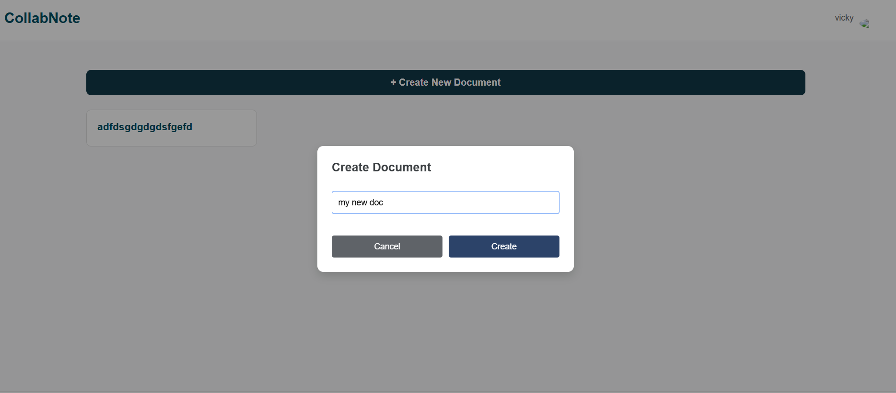
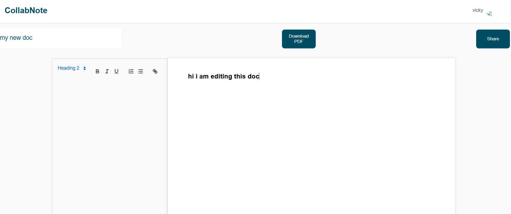

# CollabNote
You can add and edit the document in Realtime ... like the google doc

here are images if the live url is not working so that u can get the idea what this project looks like internally ...

